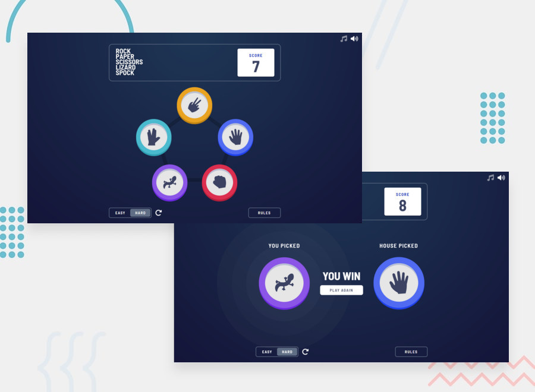
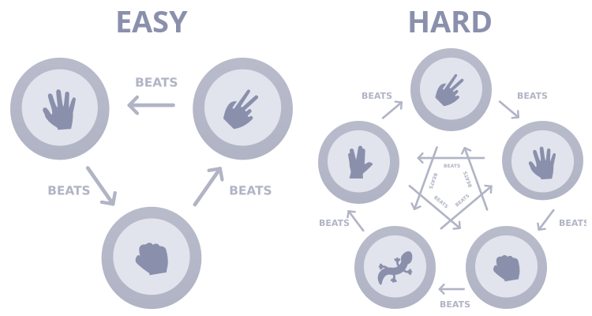
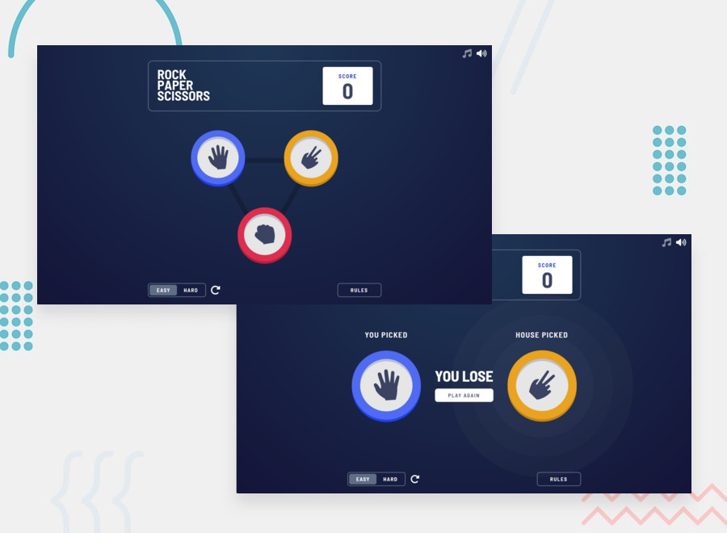
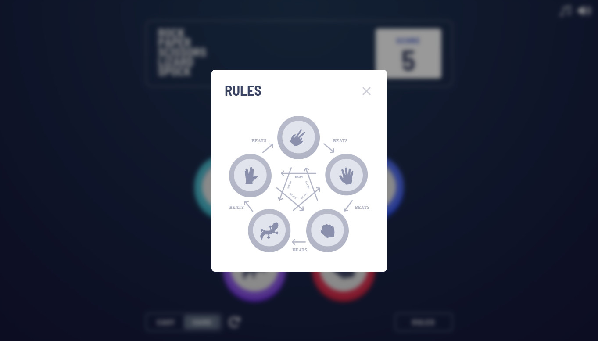
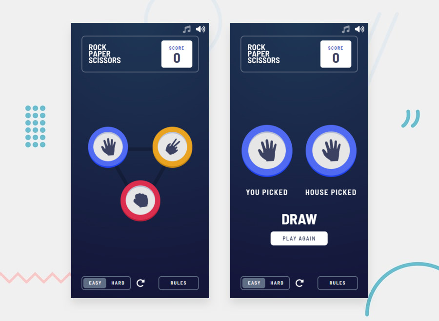
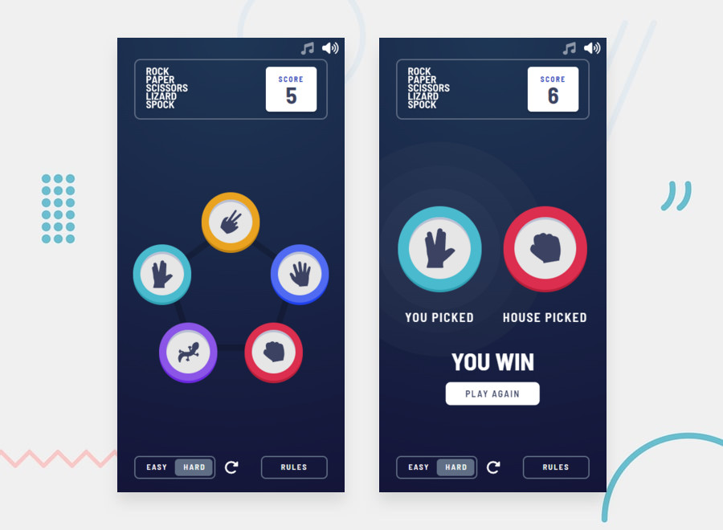
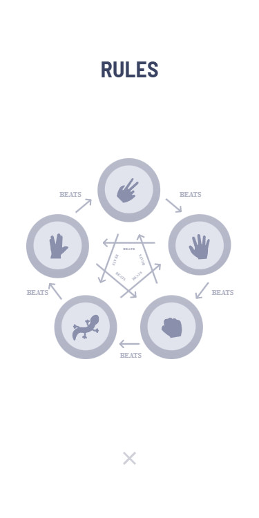

# Rock, Paper, Scissors game



## Overview

A Rock, Paper, Scissors game played against the computer. Players can switch between two difficulty modes, easy and hard. Easy mode is the classic RPS game, and hard mode is an expanded geek version called Rock, Paper, Scissors, Lizard, Spock created by [Sam Kass and Karen Bryla](https://bigbangtheory.fandom.com/wiki/Rock,_Paper,_Scissors,_Lizard,_Spock).

### Rules

If the player wins, they gain 1 point. If the computer wins, the player loses one point.



### Screenshots

<details>
  <summary>Desktop design: easy mode</summary>

  
</details>

<details>
  <summary>Desktop design: hard mode</summary>

  
</details>

<details>
  <summary>Desktop design: rules modal</summary>

  
</details>
&nbsp;

<details>
  <summary>Mobile design: easy mode</summary>

  
</details>

<details>
  <summary>Mobile design: hard mode</summary>

  
</details>

<details>
  <summary>Mobile design: rules modal</summary>

  
</details>

### Built with

- Semantic HTML5 markup
- SCSS
- JavaScript
- Animate.css

### Links

- [Live Site URL](https://ipavelgeorgiev.github.io/rock-paper-scissors)
- [Solution URL](https://www.frontendmentor.io/solutions/rock-paper-scissors-game-bPQFtnOCtt)


## Run locally

Clone the project

```bash
  git clone https://github.com/iPavelGeorgiev/rock-paper-scissors.git
```

Go to the project directory

```bash
  cd rock-paper-scissors
```

Install dependencies

```bash
  npm install
```

Start the server

```bash
  npm run start
```

## Credits

This challenge is provided by [Frontend Mentor](https://www.frontendmentor.io). Frontend Mentor is a platform where developers can learn and improve their frontend development skills alongside other developers by implementing solutions to challenges. Each challenge includes designs (both mobile and desktop), assets, and a style guide to get you started. The rest is up to you!

### The challenge
The challenge is to build out this [Rock, Paper, Scissors game](https://www.frontendmentor.io/challenges/rock-paper-scissors-game-pTgwgvgH) and get it looking as close to the design as possible.

Users should be able to:

- View the optimal layout for the game depending on their device's screen size
- Play Rock, Paper, Scissors against the computer
- Maintain the state of the score after refreshing the browser
- **Bonus**: Play Rock, Paper, Scissors, Lizard, Spock against the computer _(optional)_

Additional features added by me:
- Switch between the two difficulty modes (easy / hard)
- Reset the score of the currently active difficulty mode
- Music and volume toggles
- Animation of various elements

I don't have access to the premium Figma/Sketch files, so the design is not pixel perfect.

## Author

- Frontend Mentor - [@iPavelGeorgiev](https://www.frontendmentor.io/profile/iPavelGeorgiev)
- LinkedIn - [@iPavelGeorgiev](https://www.linkedin.com/in/ipavelgeorgiev)
